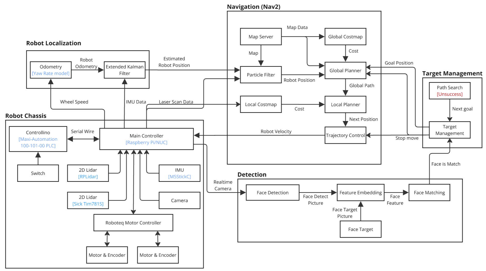

# CarverSeekBot ROS2
Project Restore CarverCab to CarverSeekBot

Update 1/06/68 [15.43]

Uncomplete 
-  Using Seek mode

**Need to reformat code and Code Comment**

# Table of content
- [Technical overview](#technical-overview)
  - [System Architecture](#system-architecture)
  - [Mobile Robot Development method](#mobile-robot-development-method)
  - [Face Matching method](#face-matching-method)
- [How to install](#how-to-install)
  - [Prerequisites](#prerequisites)
    - [Software Requirements](#software-requirements)
    - [Hardware](#hardware)
  - [1. Make Workspace](#1-make-workspace)
  - [2. Clone CarverSeekBot Package](#2-clone-carverseekbot-package)
  - [3. Build this workspace](#3-build-this-workspace)
- [How to run Package](#how-to-run-package)
  - [1. Run MicroROS for IMU (M5StickC)](#1-run-microros-for-imu-m5stickc)
    - [1.1 IMU Calibration](#11-imu-calibration)
  - [2. Launch bringup](#2-launch-bringup)
  - [3. Launch navigation (Nav2)](#3-launch-navigation-nav2)
    - [3.1 Using SLAM for mapping](#31-using-slam-for-mapping)
    - [3.2 Using Seek mode](#32-using-seek-mode)
- [Demo](#demo)
- [Future plan](#future-plan)
- [Inspection of mechanical and electrical problems](#inspection-of-mechanical-and-electrical-problems)
- [Developer Member](#developer-member)

# Technical overview
## System Architecture


## Mobile Robot Development method
* Use Nav2 package is base on develop robot navigation for Carver Cab.
* Use Robot Localized package for use Extended Kalman Filter. 

## Face Matching method
Use the buffalo_l model from [InsightFace](https://github.com/deepinsight/insightface) Opensource. This model can perform face recognition, face detection, face alignment, and facial feature analysis. All functions can be developed into a search mode to turn CarverCap into CarverSeekBot.

# How to install
## Prerequisites
### Software Requirements
Ensure you have the following dependencies installed
* [Ubuntu 24.04 (Noble Numbat)](https://releases.ubuntu.com/noble/)
* [ROS2 Jazzy](https://docs.ros.org/en/jazzy/index.html)

ROS2 Package
* [SLAM Toobox](https://docs.nav2.org/tutorials/docs/navigation2_with_slam.html) this package is used to perform SLAM mapping.
* [Nav2](https://docs.nav2.org/getting_started/index.html) this package for using Navigation
* [robot_localization](https://docs.ros.org/en/melodic/api/robot_localization/html/index.html) this package for using Navigation
* [teleop-twist-joy](https://index.ros.org/p/teleop_twist_joy/) this package for Joy Controller
  
Python Libraries:
* [PyRoboteq](https://pypi.org/project/PyRoboteq/0.0.9/) this package for Motor Controll on CarverSeekBot
* [Python OpenCV](https://pypi.org/project/opencv-python/) this package for face recognition
> [!NOTE]
> "I'm not entirely sure if the list of packages is exhaustive.

### Hardware
* [SICK TIM781S](https://www.sick.com/es/en/catalog/products/lidar-and-radar-sensors/lidar-sensors/tim/tim781s-2174104/p/p594149) for font lidar
* RPLidar A1M8 for back lidar
* [Controllino maxi automation](https://www.controllino.com/product/controllino-maxi-automation/) for Manages collision sensors (front/rear, left/right) and handles motor control signals (Emergency, Start, Stop) for motor actuation.
* [M5SitckC](https://shop.m5stack.com/products/stick-c?variant=43982750843137) for IMU
* Intel NUC for Main Controll CarverSeekBot
* [mikrotik hap ac lite tc](https://mikrotik.com/product/RB952Ui-5ac2nD-TC) for Network on CarverSeekbot

> [!NOTE]
>For future developers working with the CarverSeekBot, please note the current network IP assignments on the NUC:
>
>* SICK TIM: 192.168.1.190
>* Controllino Maxi Automation: 192.168.1.191
>* NUC: 192.168.1.195
>
> These IP addresses are hardcoded for specific devices to ensure consistent communication within the CarverSeekBot system

## 1. Make Workspace
```bash
# Make WorkSpace
mkdir -p CarverSeekbot_ws/src
# Go to workspace
cd CarverSeekbot_ws/src
```

## 2. Clone CarverSeekBot Package
```bash
#Clone CarverSeekBot 
git clone https://github.com/DenWaritthon/CarverSeekBot.git -b Jazzy

# Fetch linked repositories using vcs
vcs import < CarverSeekBot/CarverSeekBot.repos CarverSeekBot/

# Install dependencies using rosdep (including ROS)
sudo apt update
sudo apt install -y python3-rosdep python3-vcstool
sudo rosdep init
rosdep update --rosdistro=jazzy
rosdep install --from-paths src --ignore-src -r -y --rosdistro jazzy
```

## 3. Build this workspace
```bash
# Build all packages in the workspace
cd ~/CarverSeekbot_ws
colcon build
```

# How to run Package
Step by Step

## 1. Run MicroROS for IMU (M5StickC)
```bash
ros2 run micro_ros_agent micro_ros_agent serial --dev /dev/m5c
```
> [!NOTE]
>  The `/dev/m5c` port is exclusively configured for use on the CarverSeekBot's NUC.

> [!CAUTION]
> Please be aware of the following points regarding the M5StickC >acting as the IMU:
>
>* Manual Restart Required: The M5StickC's current firmware does not automatically restart when the Micro-ROS Agent is launched. This means you'll need to manually power cycle the M5StickC every time you start or restart the robot, or if the connection to the Micro-ROS Agent is lost.
>
>* IMU Recalibration After Removal: If the M5StickC is detached from the robot, it will require a recalibration of the IMU upon reattachment. This is necessary to ensure optimal and accurate IMU data for improved performance.

### 1.1 IMU Calibration
```bash
ros2 run robot_controller imu_calibrate.py
```
## 2. Launch bringup
```bash
ros2 launch robot_bringup robot_bringup.launch.py
```

You can now control the robot using the Xbox joystick (via robot_bringup) or with teleop_twist_keyboard.

## 3. Launch navigation (Nav2)
The navigation system is currently configured to operate exclusively on the 5th floor, as defined by the keepout map.


> [!CAUTION]
> Currently, the navigation and SLAM systems utilize only the front-facing LiDAR. This is due to integration issues encountered when attempting to combine data from both the RPLiDAR A1M8 and the SICK TIM781S. These issues affected map generation and navigation accuracy, so only the front LiDAR is active at this time.
> 
>As a result, the robot has no awareness of its surroundings to the rear or sides. Please exercise caution during operation, especially in environments with obstacles behind or beside the robot.

```bash
ros2 launch robot_navigation navigation.launch.py
```

### 3.1 Using SLAM for mapping 
When Need to create map for navigation
```bash
ros2 launch robot_navigation mapping.launch.py
```
When Save map done
```bash
ros2 launch robot_navigation savemap.launch.py
```
> [!NOTE]
>  Once a map is successfully generated, it will be saved to your **`/home/`** directory. Each generated map will have a **unique ID** appended to its filename, ensuring no conflicts occur.
> *(Special thanks to AJ.Nook for this feature.)*
>

### 3.2 Using Seek mode


# Demo
[](https://youtu.be/qn1z8EDL6n8?si=YRryRpS-QOs2_JkA)
**Click to watch VDO**
# Future plan
* Update power input for NUC from 12VDC to 19VDC for use full performance of NUC
* Fine-tune Nav2 parameters for improved navigation accuracy
* Implement automatic reverse movement upon obstacle collision during navigation
* Add a front bumper to the robot (design completed, pending laser cut and sensor integration)
* Integrate a navigation camera (e.g., Intel RealSense) — currently under research
* Add state management system to handle robot behavior transitions
* Integrate LiDAR intensity data from the front sensor to enhance navigation capabilities (not yet implemented)
* Investigate and resolve discrepancies when merging data from the two LiDAR sensors (RPLiDAR A1M8 and SICK TIM781S)

# Inspection of mechanical and electrical problems
This part for check list in case Carver Cab have an Electrical and Mechanical Problems.

* In case the NUC does not power on automatically after turning off the power switch and waiting for 3 minutes, you can unplug the power and plug it back in, as there is not enough power to start the NUC at startup.
* Sensor and Motor not have input voltage — check cable connection at PS1 and PS2 terminal
* In case limit switch don't update data after bumper attack — check if the fastening nuts have moved.
* If the Carver Cab vibrates more than normal during movement — check the front support wheels to make sure they are in good condition (since the wheels have worn out springs, they need to be supported with rubber pads).
  
# Developer Member
* 64340500049 - Wasupol Hengsritawat
* 65340500004 - Kraiwich Vichakhot
* 65340500014 - Chawaphon Wachiraniramit
* 65340500050 - Waritthon Kongnoo
